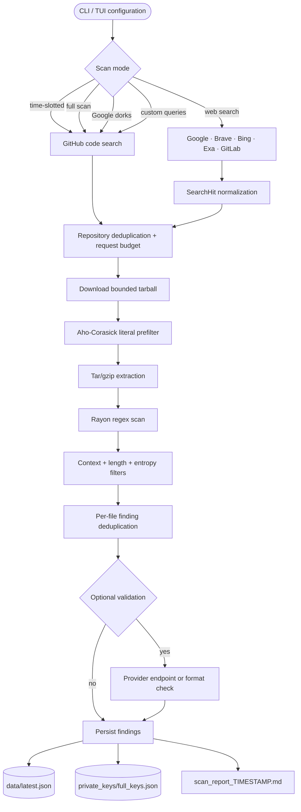
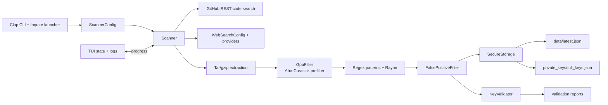
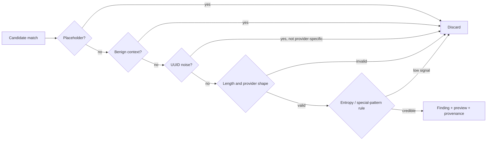
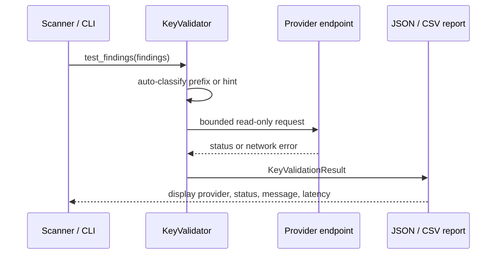
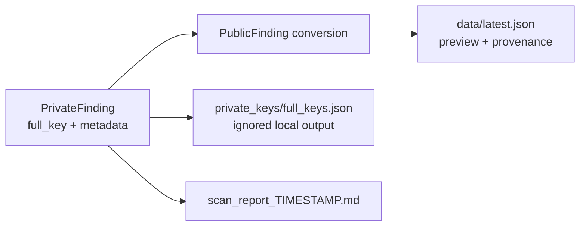
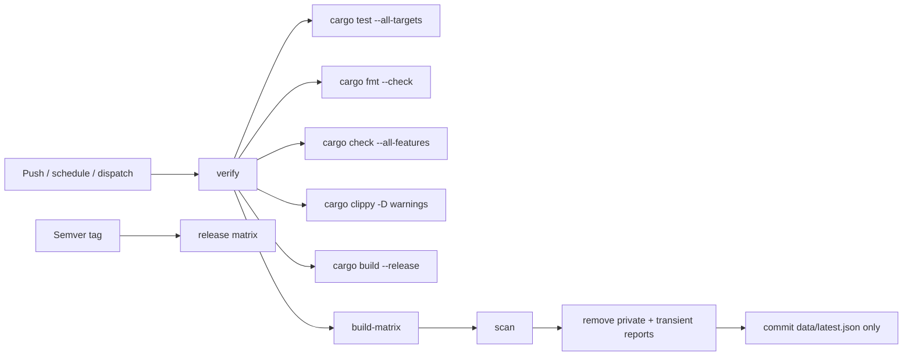
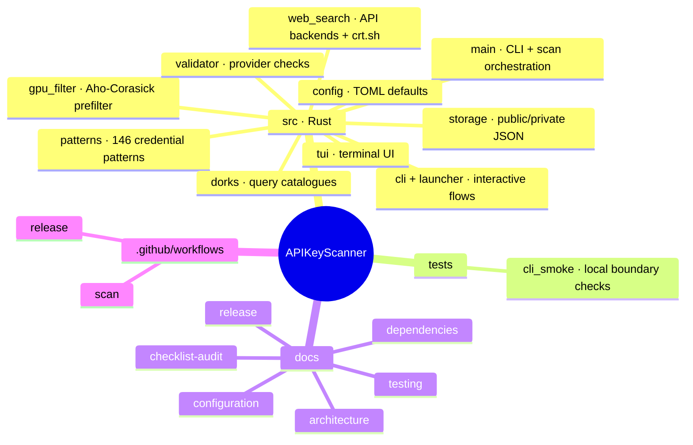

<div align="center">

<h1 align="center">
 Advanced Secret Finder
</h1>

A local-first Rust CLI that finds, triages, validates, and safely reports exposed API keys in public code.

<p align="center">
 
 
 
 
 
</p>

**English** · GitHub code search · API-backed web search · optional provider validation

</div>

---

<h1 align="center">
 
 Demo | Scan Command Center
</h1>

```text
 Advanced Secret Finder v1.0.0             mode: time-slotted · budget: 200 requests

 ──────────────────────────────────────────────────────────────────────────
   Query pass 1/1                         ● authenticated   TUI ● running
 ──────────────────────────────────────────────────────────────────────────
  Searching: OPENAI_API_KEY extension:env       repos: 30 · concurrency: 5
  Analyzing: org/example-repo                    files: prefilter → regex
  Finding:  sk-proj-…Q7k2                         entropy: 4.31 · line: 18
 ──────────────────────────────────────────────────────────────────────────
  findings: 12       high entropy: 8       requests: 73       stopped: no

 ▶ Public metadata → data/latest.json
 ▶ Full keys      → private_keys/full_keys.json (ignored)
```

> Scan only repositories and credentials you are authorized to assess.

---

<h1 align="center">
  Detection Surfaces
</h1>

| Surface | What it does | Status |
|---|---|---|
| **GitHub code search** | Time-slotted, full, dork, and custom query modes | Stable |
| **Repository tarballs** | Bounded archive download, extraction, prefilter, and parallel scan | Stable |
| **Web dorks** | Google, Brave, Bing, Exa, and GitLab API results normalized to one pipeline | Stable |
| **Certificate transparency** | Passive `crt.sh` subdomain discovery | Stable |
| **Provider validation** | Read-only endpoint checks, format checks, and result reports | Optional |
| **Interactive CLI/TUI** | Launcher, progress, logs, saved findings, and exports | Stable |

---

<h1 align="center">How It Works</h1>



<h1 align="center">
  Features
</h1>

- **146 compiled detection patterns** across AI/ML, cloud, developer tooling, SaaS, databases, messaging, commerce, private keys, and credential URLs.
- **Bounded concurrent scanning** with a shared HTTP client, atomic request/repository counters, semaphores, query budgets, repository caps, and optional wall-clock limits.
- **Fast archive analysis** with a literal prefilter before regex work, Rayon for CPU-bound matching, and `spawn_blocking` for tar/gzip processing.
- **False-positive reduction** with placeholder and benign-context checks, UUID handling, provider-specific length rules, entropy thresholds, and per-file deduplication.
- **18 provider-specific validators** plus automatic and hint-based dispatch. Validation results carry provider, key type, status, message, and response time.
- **Five web-search backends** with one `SearchHit` model; web search uses APIs rather than scraping result HTML.
- **Passive subdomain discovery** through certificate-transparency data; discovered names remain candidates, not silently live targets.
- **Public/private separation**: redacted findings are publishable; full credentials remain local under an ignored path.
- **Honest automation**: missing credentials and invalid configuration fail at the boundary instead of becoming a misleading empty scan.

---

<h1 align="center">
  What It Saves You
</h1>

| Manual security task | Scanner contribution | Benefit |
|---|---|---|
| Search many repositories by hand | Query catalogue + bounded concurrent repository analysis | Repeatable coverage |
| Inspect every file in an archive | Aho-Corasick prefilter before regex work | Less wasted CPU |
| Decide whether every match is real | Context, placeholder, UUID, length, entropy, and provider rules | Better triage signal |
| Prove whether a key still works | Optional provider validation with recorded status/time | Faster incident prioritization |
| Publish findings without leaking them again | `PublicFinding` conversion drops `full_key` | Safer reporting |
| Re-run a large scan without losing control | Request, time, repository, concurrency, and loop limits | Predictable operations |

### What the project demonstrates

- **Systems design:** async network I/O is separated from blocking archive and CPU work.
- **Security engineering:** redaction is encoded in separate public/private data models.
- **Performance thinking:** cheap literal rejection happens before expensive regex analysis.
- **Reliability:** shared counters and checkpoints preserve limits across concurrent work.
- **Operational clarity:** output paths, validation status, and failure behavior are explicit.

---

<h1 align="center">
 
 Tech Stack
</h1>

<p align="center">
 
</p>

- **Language:** Rust 2024 Edition
- **Async runtime:** Tokio
- **HTTP:** Reqwest with rustls, gzip, and JSON
- **Matching:** Regex, `LazyLock`, Aho-Corasick literal filtering, Rayon parallelism
- **CLI:** Clap, Inquire, Crossterm
- **Serialization:** Serde, Serde JSON, TOML
- **Archives:** Tar, Flate2, Zip
- **Observability:** Tracing and terminal progress/TUI state
- **Build:** Cargo with a small release profile (`opt-level = "z"`, thin LTO, stripped symbols)

---

<h1 align="center">
 
 Installation & Setup
</h1>

```bash
git clone https://github.com/yourusername/api-key-scanner.git
cd api-key-scanner
cargo build --release
```

### Requirements

- Stable Rust toolchain
- GitHub authentication for live repository scanning
- Network access for GitHub, web-search, certificate-transparency, or validation requests

### Run

```bash
# Interactive launcher / TUI
cargo run

# Bounded non-interactive scan
cargo run --release -- --token "$GITHUB_TOKEN" --max-requests 10 --no-tui

# Query modes
cargo run --release -- --full-scan --no-tui
cargo run --release -- --use-dorks --no-tui
cargo run --release -- --interactive

# API-backed web search and passive subdomain discovery
cargo run --release -- --web-search --no-tui
cargo run --release -- --web-search --discover-subdomains --domain example.com --no-tui

# Local result operations
cargo run -- --view
cargo run -- --test-keys
cargo run -- --show-dorks
```

### Configuration

Local scripted runs read `GITHUB_TOKEN` from `.env` or `--token`. GitHub Actions
uses the separate `SCANNER_TOKEN` secret and skips only the live scan when it is
not configured.

Optional configuration lives in `scanner-config.toml`:

| Field | Default | Purpose |
|---|---:|---|
| `max_requests` | `200` | Request budget per pass |
| `concurrency` | `5` | Concurrent repository analysis |
| `max_minutes` | unset | Optional wall-clock limit |
| `max_repos_per_query` | `30` | Repository cap per query |
| `max_total_repos` | unset | Optional whole-run cap |
| `query_loops` | `1` | Number of query passes |
| `scan_mode` | `time_slotted` | Query selection mode |
| `enable_validation` | `false` | Validate during scanning |
| `validate_every_n_repos` | unset | Optional checkpoint interval |
| `endless_loop` | `false` | Repeat until stopped or no new repositories |

```toml
max_requests = 200
concurrency = 5
max_repos_per_query = 30
scan_mode = "time_slotted"
enable_validation = false
enable_tui = true
```

### Build and verify

```bash
cargo build --release
cargo fmt --all -- --check
cargo check --all-targets --all-features
cargo clippy --all-targets --all-features -- -D warnings
cargo test --all-targets
cargo test --release --all-targets
```

### Cargo features

This project has no custom Cargo feature flags. `--all-features` remains in the
CI commands so the verification contract stays explicit if optional features
are introduced later.

---

<h1 align="center">
 
 Architecture
</h1>

APIKeyScanner is a local Rust command-line application. It has no database,
browser UI, IPC endpoint, JavaScript runtime, or server-side API. Local JSON and
TOML files are the persistence boundary.



### Module map

| Module | Responsibility |
|---|---|
| `main.rs` | CLI composition, GitHub search, scan orchestration, extraction, reporting |
| `patterns.rs` | Compiled credential patterns and pattern tests |
| `gpu_filter.rs` | Shared Aho-Corasick literal prefilter |
| `dorks.rs` | GitHub and web query catalogues |
| `web_search.rs` | API-backed search providers and `crt.sh` parsing |
| `validator.rs` | Provider validation and validation reports |
| `storage.rs` | Public/private finding models and local persistence |
| `config.rs` | TOML model, defaults, validation, and round trips |
| `cli.rs` / `launcher.rs` | Interactive menus and scan configuration |
| `tui.rs` | Terminal state, rendering, input, and restoration |

### Runtime boundaries

1. `main` loads environment/configuration and creates one shared `reqwest::Client`.
2. `Scanner::search_code` paginates GitHub search inside request and time limits.
3. `Scanner::analyze_repo` bounds repository work and downloads one archive.
4. Archive extraction runs away from async workers; the prefilter and Rayon scan handle CPU work.
5. Findings are deduplicated, optionally validated, then persisted through `SecureStorage`.
6. Full keys never enter the public finding model.

---

<h1 align="center">
  Scan Pipeline Details
</h1>

### Confidence filtering



The generic fallback is context-anchored and requires a long, high-entropy value.
URL and private-key patterns use special handling. Provider prefixes get
provider-specific shape checks instead of one global rule.

### Validation lifecycle



### Validation endpoints

| Mode | Providers / behavior |
|---|---|
| Read-only endpoint request | OpenAI, Anthropic, Google, xAI, Groq, Mistral, Cohere, Hugging Face, Replicate, Perplexity, DeepSeek |
| Account/token request | GitHub and Vercel |
| Service request | Slack, SendGrid, Stripe |
| Format-only or provider-specific rule | Supabase and patterns without a safe live endpoint |

### Results boundary



---

<h1 align="center">
 
 Metrics & Engineering Value
</h1>

Metrics below are codebase measurements or verified test results, not end-to-end
performance promises. Network throughput still depends on GitHub and provider
rate limits.

| Metric | Value | Source / meaning |
|---|---:|---|
| Detection pattern entries | **146** | `src/patterns.rs` compiled entries |
| Provider validation methods | **18** | `src/validator.rs` provider-specific methods |
| Validation dispatch paths | **20** | Provider methods + `validate_auto` + `validate_with_hint` |
| Web-search backends | **5** | Google, Brave, Bing, Exa, GitLab |
| Rust modules | **11** | `src/*.rs` |
| Rust source | **8,227 LOC** | Current source-tree snapshot |
| Verification suite | **45 passed** | 41 unit tests + 4 CLI smoke tests |
| Default scan budget | **200 requests** | Per pass |
| Default concurrency | **5 repositories** | Concurrent repository analysis |
| Archive cap | **50 MiB** | Maximum tarball size |

<h1 align="center">IT-Management Objectives → Metrics</h1>

I built this project to demonstrate classic IT-management objectives in practice.
Every objective below points to a verifiable artifact — a source file, a CI gate,
a test, a configuration field, or an architecture decision — never a showcase
number. If a metric cannot be checked in this repository, it is not claimed here.

| # | Objective | How Advanced Secret Finder delivers it | Verifiable metric |
|---:|---|---|---|
| 1 | **Look at the business** | Turns discovery, triage, validation, and redacted reporting into one local CLI/TUI workflow instead of disconnected scripts. | 1 CLI · 4 scan modes · 2 finding models |
| 2 | **Measure the area's performance** | The TUI and tracing state expose request count, repository count, finding count, elapsed time, and repositories per minute while a scan runs. | `requests_made` · `repos_scanned` · `findings_count` · `elapsed` · `repos/min` |
| 3 | **Allocate costs** | Request, repository, concurrency, and time limits make external API consumption explicit and controllable. | Defaults: **200 requests/pass · 5 concurrent repos · 30 repos/query** |
| 4 | **Maintain internal service levels** | Stop flags, request budgets, repository caps, time limits, bounded concurrency, and honest auth errors prevent an uncontrolled scan. | `max_requests` · `max_minutes` · `max_total_repos` · `stop_flag` |
| 5 | **Reduce cost** | Reuses one pooled HTTP client, rejects irrelevant files before regex work, and avoids unbounded provider requests. | 1 shared `reqwest::Client` · Aho-Corasick prefilter · explicit request budget |
| 6 | **Optimize structure** | Separates async HTTP, blocking archive extraction, literal prefiltering, and CPU-bound regex scanning into clear execution stages. | `spawn_blocking` + Aho-Corasick + Rayon pipeline |
| 7 | **Be agile** | Small modules and focused tests let pattern, dork, storage, validator, and CLI changes ship without broad refactors. | 11 Rust modules · 45 passing tests · CI format/check/test gates |
| 8 | **Innovate in proposed solutions** | Combines GitHub code search, five API-backed web sources, passive certificate-transparency discovery, and provider validation in one normalized workflow. | 146 patterns · 5 web backends · 20 validation dispatch paths |
| 9 | **Make accurate forecasts** | Live elapsed time and repositories-per-minute give an operator current throughput; `max_minutes` turns that observation into a bounded run plan. | TUI `elapsed` + `repos/min` · configurable wall-clock limit |
| 10 | **Don't focus on "commodities"** | Mature crates provide HTTP, async scheduling, serialization, regex, and archives; project-specific logic stays in scanning, filtering, validation, and reporting. | `main.rs` · `patterns.rs` · `gpu_filter.rs` · `validator.rs` own the differentiators |
| 11 | **Generate correct information** | Typed `PrivateFinding`, `PublicFinding`, `SearchHit`, and `KeyValidationResult` models carry provenance, previews, entropy, status, and latency without mixing concerns. | Storage test proves public JSON excludes `full_key` |
| 12 | **Maintain Business Intelligence** | Public JSON, timestamped Markdown reports, validation JSON/CSV, structured tracing, and TUI counters turn scans into reviewable operational data. | `data/latest.json` · `scan_report_*.md` · validation reports · tracing logs |
| 13 | **Focus on value actions** | Tests target real failure boundaries: pattern invariants, dork coverage, archive extraction, redaction, web parsing, configuration, and CLI behavior. | 41 unit tests + 4 CLI smoke tests = **45 passing** |
| 14 | **Keep critical processes running** | A single bad repository is logged and isolated, blocking work leaves Tokio workers, and optional checkpoints persist progress during long scans. | `spawn_blocking` · per-repo error path · `validate_every_n_repos` |
| 15 | **Keep the environment secure** | Full credentials stay in ignored private storage; public conversion retains metadata and previews but never the full key. | `PrivateFinding.full_key` absent from `PublicFinding` · `private_keys/` ignored |
| 16 | **Keep infrastructure 24×7×365** | The scheduled workflow can run repeatedly without a live operator; concurrency cancellation prevents overlapping scan runs. | GitHub schedule: every **10 minutes** · `cancel-in-progress: true` |
| 17 | **Reusable model** | One `SearchHit` shape normalizes web providers, one finding conversion owns redaction, and one validation result shape covers provider responses. | 5 providers → 1 `SearchHit` · 1 `PrivateFinding` → `PublicFinding` boundary |
| 18 | **Win over the business people** | Quick-start commands, interactive configuration, public/private output explanations, and linked architecture/config/testing docs make the tool understandable outside the implementation. | README + **6 linked docs** · CLI/TUI and non-TUI paths |
| 19 | **Be more efficient, more effective** | CI enforces formatting, type checking, Clippy warnings, tests, release tests, and optimized release builds. | `cargo clippy ... -D warnings` · `cargo fmt --check` · release profile with thin LTO |
| 20 | **Standardize processes** | The workflows separate verification, cross-platform build, scheduled scan, public-output cleanup, and tagged release packaging. | 2 workflow files · `verify` / `build-matrix` / `scan` / release jobs |
| 21 | **Automate user tasks** | Query selection, repository deduplication, archive scanning, candidate filtering, validation, report generation, and public-output preparation run automatically. | 4 scan modes · 146 patterns · automated JSON/Markdown reports |

---

<h1 align="center">
  GitHub Actions CI/CD
</h1>

### Workflow matrix

| Job | Trigger | What it verifies |
|---|---|---|
| `verify` | Push / dispatch / schedule | Test, format, all-feature check, Clippy, version consistency, release test, release build |
| `build-matrix` | After `verify` | Release builds on Ubuntu and Windows |
| `scan` | After verification and builds | Optional live scan, removes private/transient output, commits only `data/latest.json` |
| `release` | `v*` tag | Linux, macOS, and Windows release archives with SHA256 files |



The live scan is opt-in through `SCANNER_TOKEN`. Missing credentials do not make
verification look successful as a scan; they skip only the live network step.

---

<h1 align="center">
  Project Structure
</h1>



---

<h1 align="center">
  Limitations & Notes
</h1>

### Out of scope

- No database, browser UI, IPC layer, JavaScript runtime, or server-side API.
- No arbitrary page crawling: web discovery uses configured APIs and normalized snippets.
- Provider validation is not uniform; some providers are format-only by design.
- Public output is metadata and previews, not a replacement for credential rotation or incident response.

### Guarantees and operating notes

- `data/latest.json` excludes `full_key`; `private_keys/full_keys.json` is intentionally ignored.
- Network work stays async; archive and CPU-heavy work stays outside async workers.
- Request/repository limits apply across concurrent work through shared counters.
- `crt.sh` names are candidates and are not treated as live hosts until separately resolved.
- Rate limits and external service latency dominate real scan duration.

### Responsible use

This project is for authorized security research, auditing, and education. Obtain
permission before scanning repositories or validating credentials. Rotate exposed
credentials and treat local full-key output as sensitive material.

---

<h1 align="center"> CV-ready project summary</h1>

> Built a Rust 2024 secret-scanning CLI that combines bounded asynchronous GitHub/web search, concurrent tarball analysis, Aho-Corasick prefiltering, Rayon regex processing, context/entropy filtering, provider validation, and a public/private storage boundary that publishes redacted findings without exposing full credentials.

### Engineering signals to discuss

- **Concurrency:** bounded futures, semaphores, atomics, request budgeting, and checkpoint persistence.
- **Security:** redaction by data model, ignored private output, provider-aware validation, and honest auth failures.
- **Performance:** pooled HTTP connections, cheap literal filtering, blocking-work isolation, and parallel CPU scanning.
- **Quality:** 146 pattern invariants, configuration/dork tests, archive regression coverage, storage redaction tests, web parsing tests, and CLI smoke tests.
- **Operations:** TUI progress, structured tracing, public artifact commits, release verification, and cross-platform builds.

---

<h1 align="center"> References</h1>

<h2 align="center">

**Rust**: [rust-lang.org](https://www.rust-lang.org/) · **Tokio**: [tokio.rs](https://tokio.rs/) · **Reqwest**: [docs.rs/reqwest](https://docs.rs/reqwest/)

</h2>

<h2 align="center">

**GitHub code search**: [REST API](https://docs.github.com/rest/search/search) · **Secret scanning patterns**: [GitHub Docs](https://docs.github.com/en/code-security/secret-scanning/secret-scanning-patterns)

</h2>

<h2 align="center">

**Gitleaks**: [github.com/gitleaks/gitleaks](https://github.com/gitleaks/gitleaks) · **TruffleHog**: [github.com/trufflesecurity/trufflehog](https://github.com/trufflesecurity/trufflehog)

</h2>

<h2 align="center">

**Aho-Corasick**: [algorithm reference](https://en.wikipedia.org/wiki/Aho%E2%80%93Corasick_algorithm) · **crt.sh**: [Certificate Transparency search](https://crt.sh/)

</h2>

## Documentation index

- [Architecture and runtime flow](docs/architecture.md)
- [Configuration reference](docs/configuration.md)
- [Testing and verification](docs/testing.md)
- [Dependency policy and audit](docs/dependencies.md)
- [Release verification](docs/release.md)
- [Audit checklist](docs/checklist-audit.md)
- [Contributing](CONTRIBUTING.md)
- [Changelog](CHANGELOG.md)

<h1 align="center">Disclaimer & Credits</h1>

<p align="center">
  <strong>Educational Use Only</strong><br>
  Advanced Secret Finder is designed for authorized security research and auditing.<br>
  Developed by Matheus Sobral - Cybersecurity Researcher
</p>
